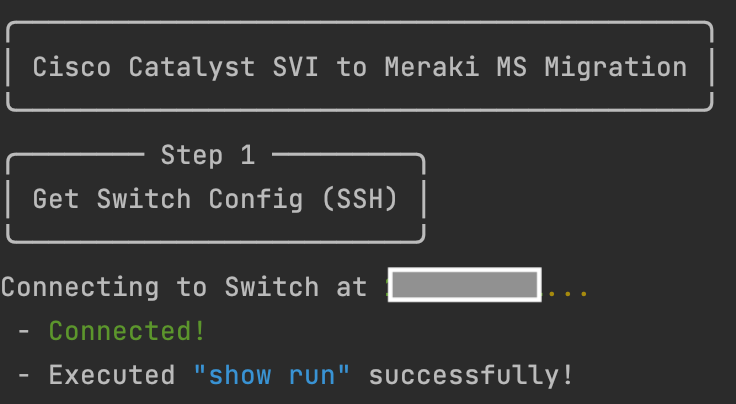
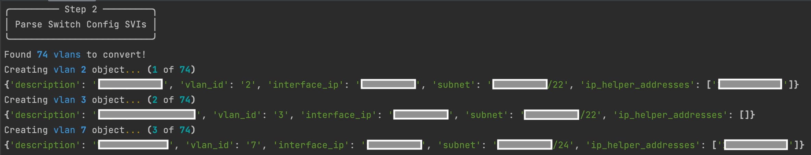
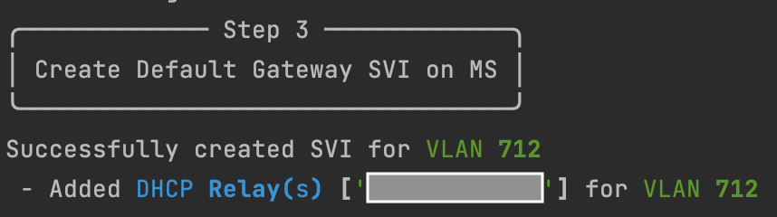
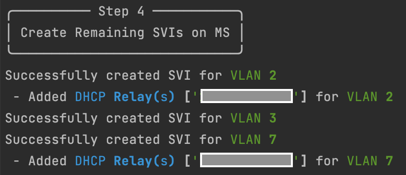
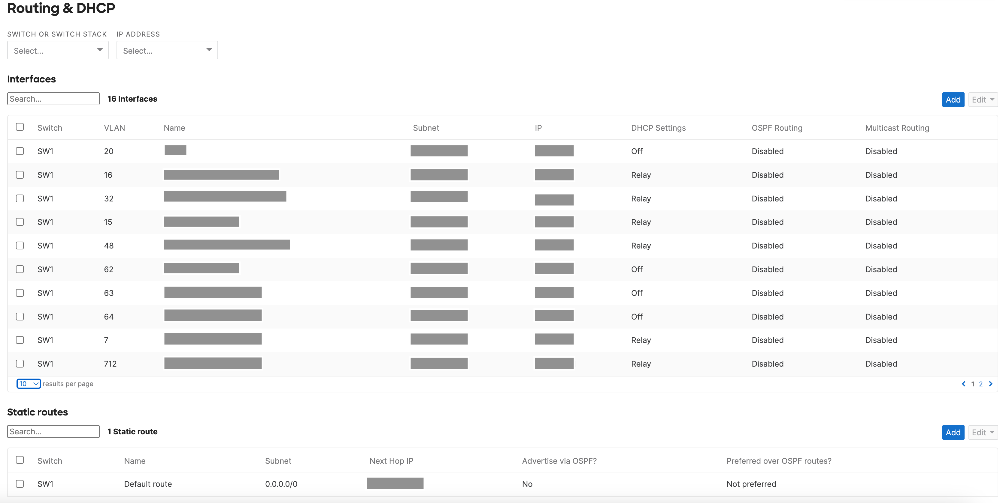

# Cisco Catalyst to Meraki SVI Migration

This script pulls the `show run` output from a Cisco Catalyst Switch (using SSH), parses the SVIs, and configures those SVIs on a Meraki MS Switch.

**Note:**
This script skips any preexisting VLAN IDs configured on the MS.

## Contacts
* Mark Orszycki
* Trevor Maco

## Solution Components
* Meraki
* Catalyst

## Prerequisites
#### Meraki API Keys
In order to use the Meraki API, you need to enable the API for your organization first. After enabling API access, you can generate an API key. Follow these instructions to enable API access and generate an API key:
1. Login to the Meraki dashboard
2. In the left-hand menu, navigate to `Organization > Settings > Dashboard API access`
3. Click on `Enable access to the Cisco Meraki Dashboard API`
4. Go to `My Profile > API access`
5. Under API access, click on `Generate API key`
6. Save the API key in a safe place. The API key will only be shown once for security purposes, so it is very important to take note of the key then. In case you lose the key, then you have to revoke the key and a generate a new key. Moreover, there is a limit of only two API keys per profile.

> For more information on how to generate an API key, please click [here](https://developer.cisco.com/meraki/api-v1/#!authorization/authorization). 

> Note: You can add your account as Full Organization Admin to your organizations by following the instructions [here](https://documentation.meraki.com/General_Administration/Managing_Dashboard_Access/Managing_Dashboard_Administrators_and_Permissions).

## Installation/Configuration
1. Clone this repository with `git clone [repository name]`
2. Add Meraki API key, and the MS Switch Serial to variables in `config.py`
```python
API_KEY = ""
MS_SERIAL = "XXXX-XXXX-XXXX"
```
3. Add Catalyst Switch credentials and IP to variables in `config.py`. 
```python
SWITCH_IP = "X.X.X.X"
SWITCH_USERNAME = ""
SWITCH_PASSWORD = ""
SWITCH_SECRET = ""
```
**Note:** Please ensure SSH is configured on the Catalyst Switch, as this is required for the Netmiko SSH connection. For more information on Netmiko, consult this [guide](https://pyneng.readthedocs.io/en/latest/book/18_ssh_telnet/netmiko.html). 

4. Add the MS Switch's Default Gateway, and DHCP Server IPs to `config.py`
```python
DEFAULT_GATEWAY = "W.X.Y.Z"
DHCP_SERVER = ["X.X.X.X", "Y.Y.Y.Y"]
```

**Note:** 
* `Default Gateway`: The Default Gateway for the MS Switch must exist on exactly one imported SVI or be configured on the MS already. The default gateway serves as the destination for traffic if it can't be routed within or between SVI's on the MS Switch.
* `DHCP Server` : A list of one or more DHCP Server IPs can be configured. If an SVI contains a `ip helper-address [DHCP IP]` line, the DHCP Server IP will be configured as a relay on the MS SVI. Only DHCP relay is supported at this time.

5. Set up a Python virtual environment. Make sure Python 3 is installed in your environment, and if not, you may download Python [here](https://www.python.org/downloads/). Once Python 3 is installed in your environment, you can activate the virtual environment with the instructions found [here](https://docs.python.org/3/tutorial/venv.html).
6. Install the requirements with `pip3 install -r requirements.txt`

## Usage
To run the program, use the command:
```
$ python3 create_meraki_svi.py
```

The script will connect to the Catalyst Switch:



Parse the SVI's from the `Show Run` output:

**Note:** Secondary IPs are ignored!



Create the Default Gateway SVI (must be done first!):



Create the remaining SVIs:



On script completion, the `MS > Routing and DHCP` section will now look like:



# Screenshots


### LICENSE

Provided under Cisco Sample Code License, for details see [LICENSE](LICENSE.md)

### CODE_OF_CONDUCT

Our code of conduct is available [here](CODE_OF_CONDUCT.md)

### CONTRIBUTING

See our contributing guidelines [here](CONTRIBUTING.md)

#### DISCLAIMER:
<b>Please note:</b> This script is meant for demo purposes only. All tools/ scripts in this repo are released for use "AS IS" without any warranties of any kind, including, but not limited to their installation, use, or performance. Any use of these scripts and tools is at your own risk. There is no guarantee that they have been through thorough testing in a comparable environment and we are not responsible for any damage or data loss incurred with their use.
You are responsible for reviewing and testing any scripts you run thoroughly before use in any non-testing environment.